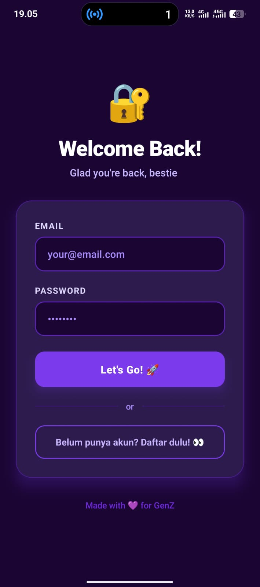
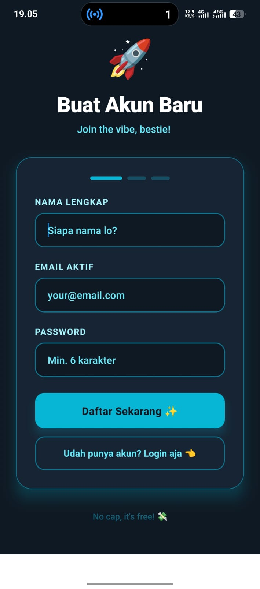
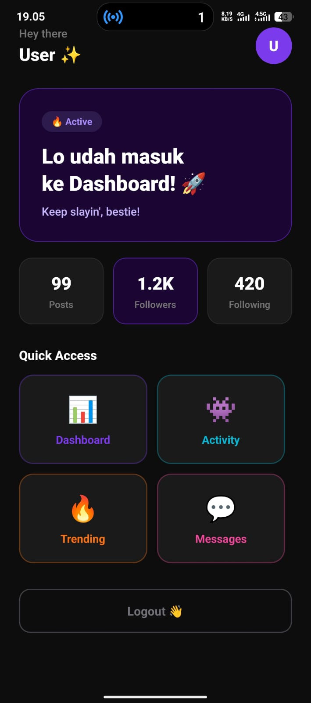

# Project M4: Interaction Master ⚡
Tugas praktikum Minggu 4 - State & Events.

## 📸 Preview

## 🛠️ Logic Implemented
- **useState Hook:** Managing name and role input.
- **Event Handlers:** onChangeText for real-time binding.
- **Reset Logic:** Clearing all states with one tap.

## 🔗 Demo

  
  
  

👉 Link langsung:
- https://snack.expo.dev/@diko-dev/mature-yellow-stroopwafel
- https://snack.expo.dev/@diko-dev/cranky-yellow-nachos
- https://snack.expo.dev/@diko-dev/upbeat-violet-cereal